># iDigiCloudTech Pvt. Ltd.

>## POC on Automated DB deployment tool (Flyway)

**Flyway** is based around seven basic commands: Migrate, Clean, Info, Validate, Undo, Baseline, and Repair.
Migrations can be written in SQL (database-specific syntax such as PL/SQL, T-SQL, etc is supported) or Java (for advanced data transformations or dealing with LOBs).
It has a command-line client, a Java API (also works on Android) for migrating the database on application startup, a Maven plugin, and a Gradle plugin.

Supported databases include Oracle, SQL Server, DB2, MySQL (including Amazon RDS, Aurora MySQL, MariaDB), Percona XtraDB, PostgreSQL (including Amazon RDS and Heroku), Aurora PostgreSQL, YugabyteDB, CockroachDB, Redshift, Informix, H2, Hsql, Derby, SQLite, SAP HANA, Sybase ASE, Phoenix, and Firebird. 

---
>## Flyway Commands:

>### Migrate: 
Migrates the schema to the latest version. Flyway will create the schema history table automatically if it doesn’t exist. Migrate is the centerpiece of the Flyway workflow. It will scan the filesystem or your classpath for available migrations. It will compare them to the migrations that have been applied to the database. If any difference is found, it will migrate the database to close the gap. Migrate should preferably be executed on application startup to avoid any incompatibilities between the database and the expectations of the code.

>### Info: 
Prints the details and status information about all the migrations.

>### Validate: 
Validate applied migrations against resolved ones (on the filesystem or classpath) to detect accidental changes that may prevent the schema(s) from being recreated exactly.

Validation fails if
- differences in migration names, types, or checksums are found
- versions have been applied that aren’t resolved locally anymore
- versions have been resolved that haven’t been applied yet

>### Baseline: 
Baselines an existing database, excluding all migrations up to and including baselineVersion.

>### Repair: 
Repairs the Flyway schema history table. This will perform the following actions:
- Remove any failed migrations on databases without DDL transactions
(User objects left behind must still be cleaned up manually)
- Realign the checksums, descriptions, and types of the applied migrations with the ones of the available migrations.

>### Undo: 
Undoes the most recently applied versioned migration.

>### Clean: 
Drops all objects (tables, views, procedures, triggers, …) in the configured schemas. The schemas are cleaned in the order specified by the schemas property.

---

>## Naming convention:
The default naming patterns within Flyway are documented clearly. You have a prefix that determines the type of file, whether a versioned migration (V), an undo migration (U), or a repeatable migration (R). That goes at the front of the file name. Next, you have a version number. This can be almost any format that you like, but it has to be unique for any given migration (although a versioned migration and an undo migration must share a common version number) and it has to be logically ordered. Then, you add two underscores, in order to separate the functional naming aspects of the file from the purely descriptive. After that, it’s just text. You can use an underscore between words and it will be translated as spaces. 
- V1__create_idigicloudemp.sql
- V3__insert_idcemp.sql
- R__insert_IDCEMPTEST.sql

---

>## PoC Scenarios:

>### Scenario1: Single script for migration using flyway migrate
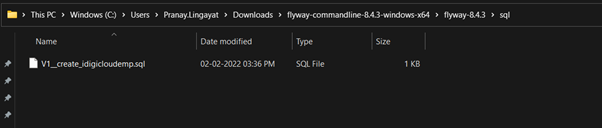

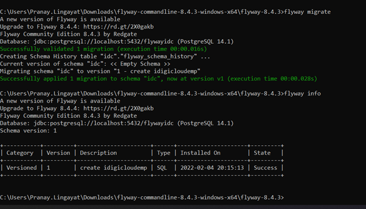

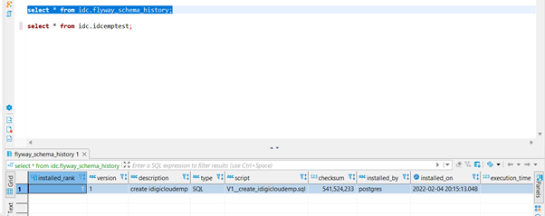

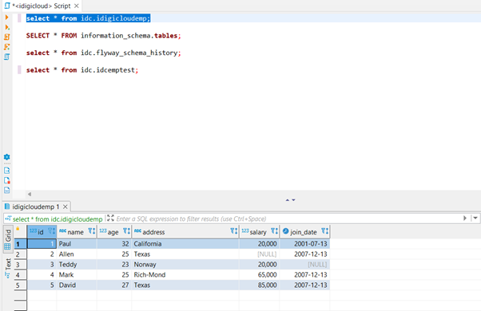

>### Scenarios 2: Executing Flyway migrate again without any change in version.

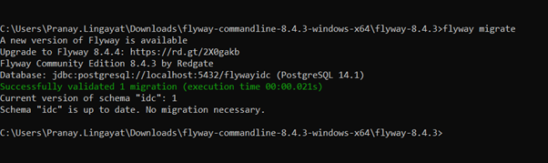

>### Scenario 3: Executing multiple versions in sequence

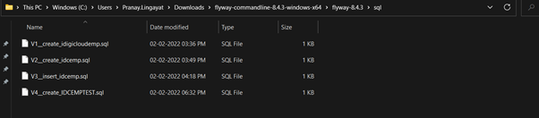

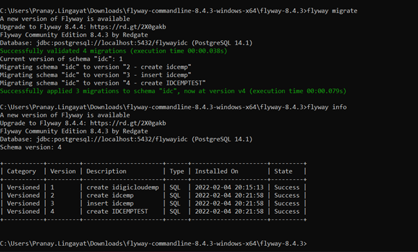

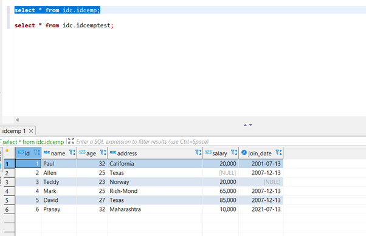

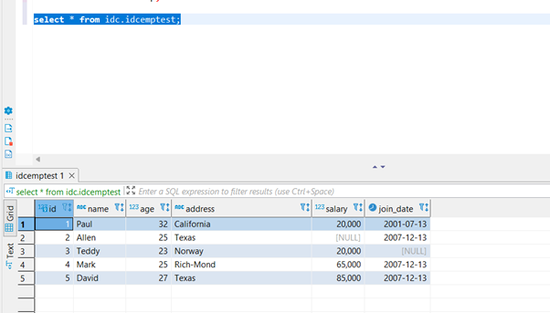

>### Scenario 4: Executing Flyway migrate again without any change in a version for multiple scripts

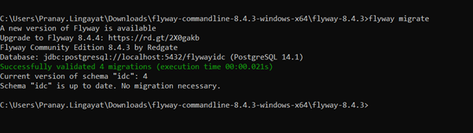

>### Scenario 5: To test Incorrect script placed for migration

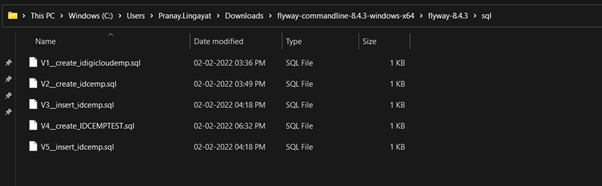

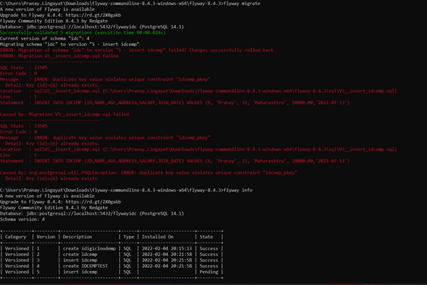

After correction,

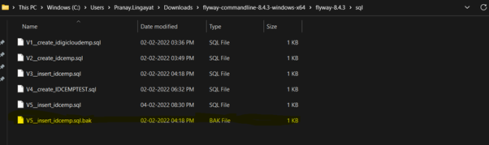

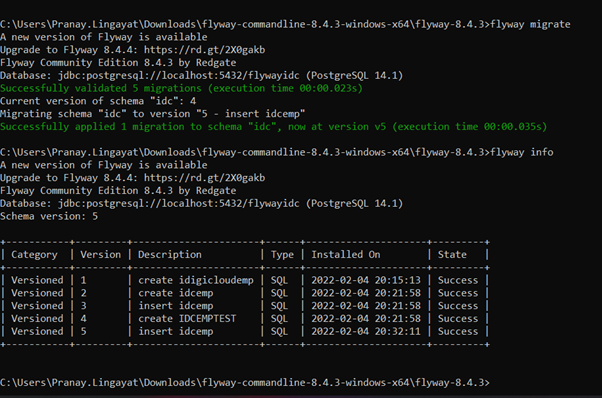

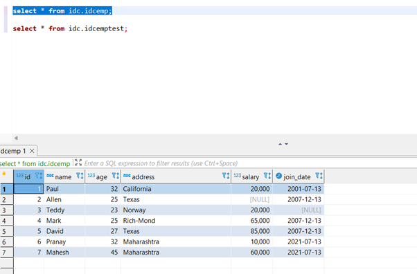

>### Scenario 6: Flyway Clean

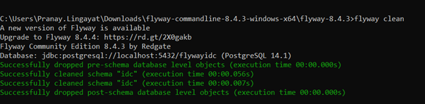

>### Scenario 7: Repeatable migration

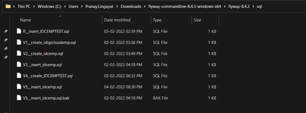

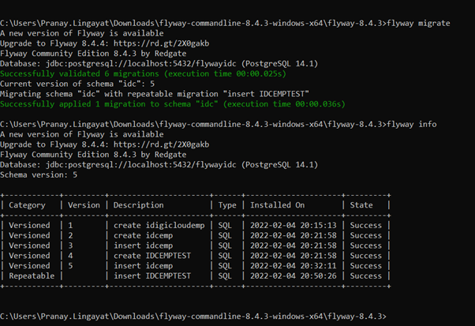

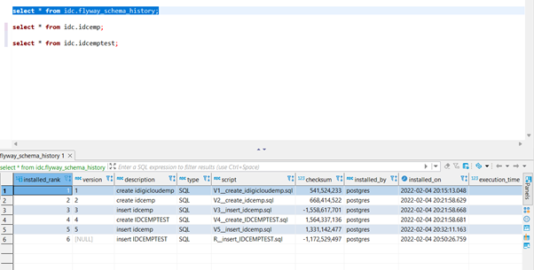

>### Scenario 8: Change in the repeatable migration and executing flyway migrate

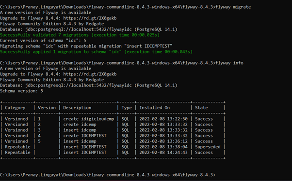

>### Scenario 9: Baseline the version

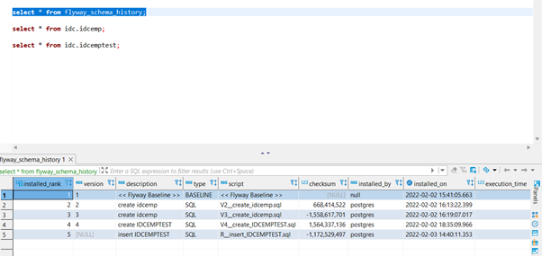

---

>## Logging Mechanism
Flyway does not create logging but it can be achived using Logback as shown below

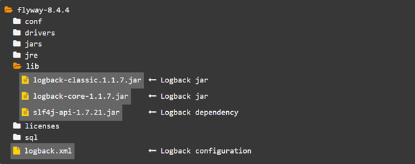

Download the jar file from the mentioned link

[Download](https://jar-download.com/artifacts/ch.qos.logback/logback-classic/1.1.9/source-code)

Logback XML can be downloaded from the below link

[Logback](https://stackoverflow.com/questions/41106265/how-configure-logging-for-flyway-command-line)

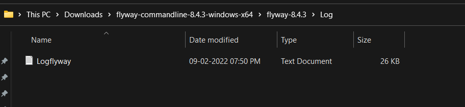

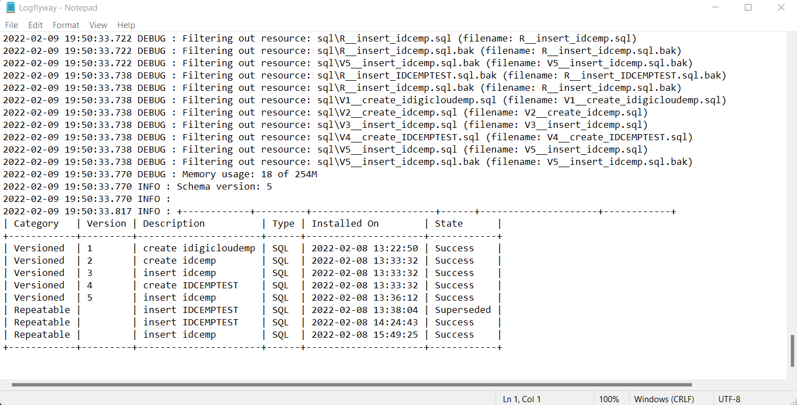

---

>## PoC Acceptance Criteria:
1. Execute DDL to Environment
2. Execute DML to Environment
3. Maintain Scripts execution history
4. Incremental DB release to environment
5. Any standard practices like naming convention, handling commits document those.

---

>## Please note the below points while using Flyway migration tool for db check-in practices.

- Naming conventions, as mentioned above.
- Do not write commit in script.
- All dml’s should have first delete and then insert so that we can rerun the scripts again and again.
- For creating the log file, use the logging mechanism mentioned above.
- To make sure that scripts are executed in order........WIP